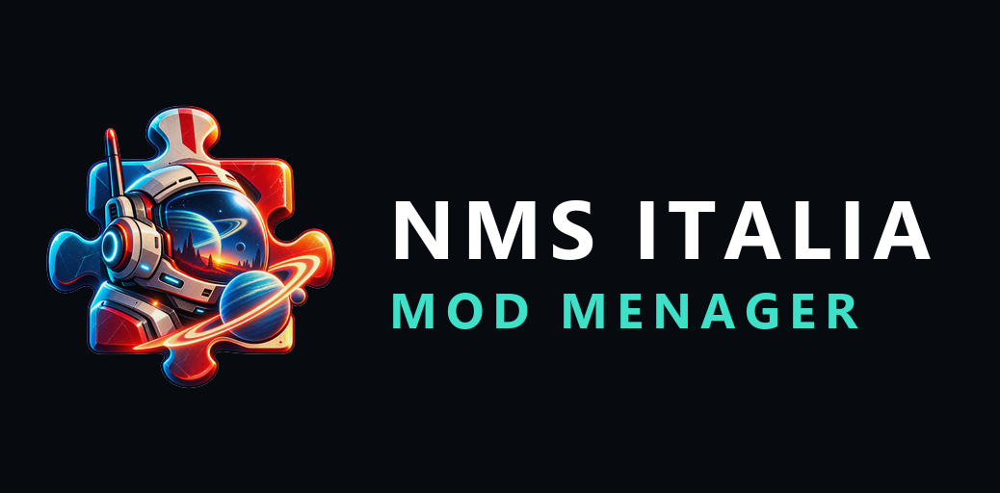

# NMS ITALIA MOD MENAGER

**Il centro di controllo definitivo per le mod di No Man's Sky.**

> Progetto community non ufficiale. Non affiliato ne' approvato da Hello Games.

> **Sviluppato con l'aiuto dell'intelligenza artificiale**, in modo dichiarato e
> senza nasconderlo. Le decisioni tecniche, la verifica del comportamento e la
> responsabilita' del risultato restano umane.

---

## Che cos'e'

Un gestore di mod per No Man's Sky, in italiano. Non si limita a copiare file in
una cartella: spiega lo stato del modding.

- cosa ho installato?
- perche' questa mod non funziona?
- quale mod mi sta facendo crashare il gioco?
- cosa e' cambiato dopo l'aggiornamento del gioco?
- come torno a una configurazione che funzionava?

---

## Installazione

Il programma **non richiede l'installazione di .NET** e **funziona offline**.

1. scarica `NMSItalia.ModMenager.zip` dalla pagina delle **release**;
2. scompattalo dove preferisci — **non** dentro la cartella di No Man's Sky;
3. avvia `NMSItalia.ModMenager.App.exe`.

Windows mostrera' un avviso al primo avvio: il programma non e' firmato
digitalmente. "Ulteriori informazioni" → "Esegui comunque".

Guida completa, disinstallazione e problemi comuni:
**[`docs/INSTALLAZIONE.md`](docs/INSTALLAZIONE.md)**
— oppure online, con le figure: **[guida all'installazione](https://sbri0110.github.io/NMS-ITALIA-MOD-MENAGER/installazione.html)**

---

## Cosa fa

- **Rileva il gioco da solo** su Steam, Xbox PC / Game Pass e GOG, oppure dalla
  cartella che indichi tu — rivalidata a ogni avvio.
- **Avvia No Man's Sky** con il metodo corretto per la piattaforma: protocollo
  Steam, percorso registrato per Xbox, eseguibile per GOG.
- **Installa e rimuove le mod** da archivi ZIP, 7Z e RAR. Ogni operazione e'
  reversibile: un errore a meta' lascia il gioco esattamente com'era.
- **Installa da Nexus Mods** senza passare dal browser, con API ufficiali. Con
  un account Premium il download parte direttamente; con un account gratuito
  incolli il collegamento `.nxm` dal sito. Ogni archivio viene verificato con
  la sua impronta SHA-256.
- **Analizza i file `.MBIN`** tramite MBINCompiler, per vedere cosa una mod
  cambia davvero. La versione dello strumento viene verificata prima di ogni
  uso: una versione diversa non fallisce, produce un risultato sbagliato senza
  segnalarlo, e il programma preferisce non usarla.
- **Attiva e disattiva una singola mod**, e attiva la **Safe Mode**, usando i
  meccanismi nativi del gioco: non sposta e non rinomina nulla.
- **Trova i conflitti reali.** Due mod che toccano lo stesso file ma proprieta'
  diverse **non** vengono segnalate come in conflitto.
- **Diagnostica completa** in sola lettura: ogni controllo con la spiegazione di
  cosa significa e cosa fare.
- **Trova la mod problematica** per bisezione: con cinquanta mod servono sei
  avvii del gioco, non cinquanta.
- **Profili, backup e ripristino** reversibile.
- **Si aggiorna da solo**, su tua richiesta: controlla le release, scarica,
  verifica l'impronta SHA-256 e sostituisce i file al riavvio.
- **Interfaccia interamente in italiano**, tema scuro.

## Cosa non fa

- **Non esegue mai** codice contenuto in una mod.
- Non invia nulla in rete se non premi un pulsante. Il controllo degli
  aggiornamenti all'avvio e' disattivato per impostazione predefinita.
- Non chiede privilegi amministrativi, e non installa nulla nel sistema.
- Non e' firmato digitalmente.

---

## Requisiti

- **Windows 10** o successivo, 64 bit
- **No Man's Sky** su Steam, Xbox PC / Game Pass o GOG

Il pacchetto e' **autosufficiente**: non serve installare .NET.

---

## Prima di installare una mod: leggere questo

Le guide in circolazione sono in gran parte obsolete. Da **Worlds Part II**
(No Man's Sky 5.50 e successivi) le mod vanno in `GAMEDATA\MODS`, una
**cartella** per mod — non in `PCBANKS\MODS` come file `.pak`.

Conseguenza: una mod messa nel percorso vecchio **non viene caricata**, e un
file `.MXML` o `.PAK` **non funziona piu'**.

La documentazione completa, con le fonti verificate:
**[`docs/FORMATO-MOD-NMS.md`](docs/FORMATO-MOD-NMS.md)**

---

## Community

Il progetto nasce e vive nel server **NMS Italia** su Discord: supporto,
segnalazioni e aggiornamenti.

### <https://discord.gg/KB2NbjCW6h>

**Sito del progetto:** <https://sbri0110.github.io/NMS-ITALIA-MOD-MENAGER/>

---

## Documenti

| Documento | Cosa contiene |
|---|---|
| [`docs/INSTALLAZIONE.md`](docs/INSTALLAZIONE.md) | installazione, avvio, disinstallazione, problemi comuni |
| [`CHANGELOG.md`](CHANGELOG.md) | cosa fa questa versione, e cosa non fa |
| [`docs/FORMATO-MOD-NMS.md`](docs/FORMATO-MOD-NMS.md) | il formato delle mod di No Man's Sky, verificato sul campo |
| [`SECURITY.md`](SECURITY.md) | come sono trattati gli archivi delle mod |
| [`PRIVACY.md`](PRIVACY.md) | cosa il programma raccoglie e cosa invia in rete |
| [`THIRD_PARTY_NOTICES.md`](THIRD_PARTY_NOTICES.md) | librerie di terze parti e licenze |

---

## Licenza

**Proprietaria — tutti i diritti riservati.** Vedi [`LICENSE`](LICENSE).

Uso **gratuito**. Vietate la modifica, la ridistribuzione, la vendita e
l'ingegneria inversa. Il codice sorgente non e' distribuito: il programma e'
disponibile solo in forma compilata.
